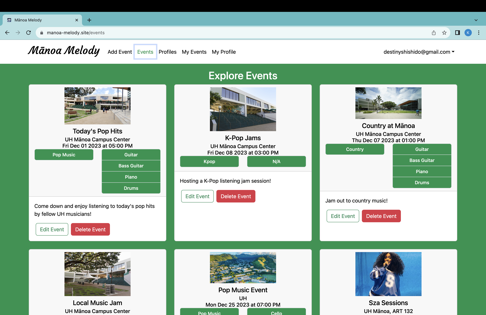
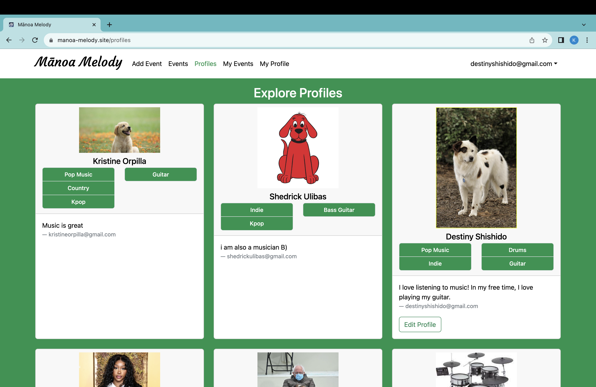

  
  
  

Mānoa Melody is a website catered for UH Mānoa students. It allows student musicians to connect with other musicians, provides a platform for musicians to advertise their events, and allows students to connect with others who share the same musicals interests as them.

The website has two main components for the users: the events page and the profiles page. In the events page, it showcases all of the events that users have added in the website. Each event includes important information, such as its location, time and date, and genres and instruments that correlate to the event. In this events page, my group and I aimed that this can be a convenient way for musicians to share their events and for students to find musical events that suits their tastes. The profiles pages showcases the profiles of all the users in Mānoa Melody. It showcases information about the user such as the instruments they play and the genres they are interested in. This page is to allow people to meet and connect with others who have similar musical tastes as them, and for musicians to connect with fellow musicians.

In this project, I was able to touch upon many aspects. One of the main parts I worked on were the Events. I was able to create the Events collection, where I was able to create the Add Event page for the users. I also worked on the Event card, which is the component that displays the data of an event. I was also able to touch upon Testcafe tests, which were something very new to me. I created a few tests, mainly for the Events pages. Lastly, throughout the project, I was in charge of the project's homepage. My responsibilities were to update the homepage for each milestone and to post the homepage URL. All in all, I had the opportunity to work in various parts of the project. 

